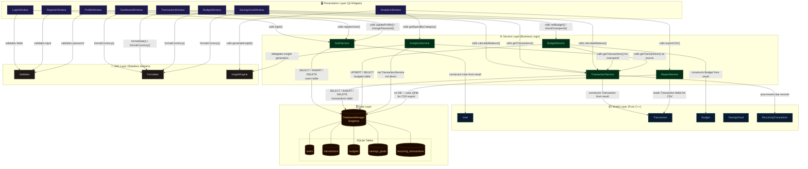
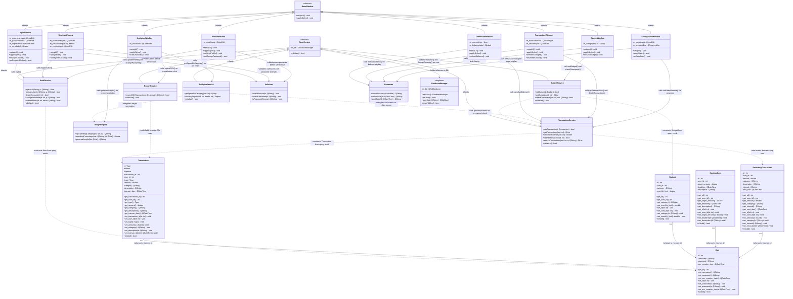

# FinStack — UML Diagrams

---

## Diagram 1 — Layer Architecture & Database Connections

```mermaid
flowchart TD

    subgraph UI["🖥️ Presentation Layer (Qt Widgets)"]
        LW[LoginWindow]
        RW[RegisterWindow]
        DW[DashboardWindow]
        TW[TransactionWindow]
        AW[AnalyticsWindow]
        BW[BudgetWindow]
        SW[SavingsGoalWindow]
        PW[ProfileWindow]
    end

    subgraph SVC["⚙️ Service Layer (Business Logic)"]
        AS[AuthService]
        TS[TransactionService]
        BS[BudgetService]
        ANS[AnalyticsService]
        RS[ReportService]
    end

    subgraph MDL["📦 Model Layer (Pure C++)"]
        U[User]
        T[Transaction]
        B[Budget]
        SG[SavingsGoal]
        RT[RecurringTransaction]
    end

    subgraph UTL["🔧 Utils Layer (Stateless Helpers)"]
        V[Validator]
        F[Formatter]
        IE[InsightEngine]
    end

    subgraph DB["🗄️ Data Layer"]
        DM[(DatabaseManager\nSingleton)]
        subgraph TABLES["SQLite Tables"]
            T1[(users)]
            T2[(transactions)]
            T3[(budgets)]
            T4[(savings_goals)]
            T5[(recurring_transactions)]
        end
    end

    %% UI → Services
    LW -->|"calls login()"| AS
    LW -->|"validates fields"| V
    RW -->|"calls registerUser()"| AS
    RW -->|"validates input"| V
    DW -->|"calls calculateBalance()"| TS
    DW -->|"formatCurrency()"| F
    TW -->|"calls getTransactions()"| TS
    TW -->|"formatDate() / formatCurrency()"| F
    AW -->|"calls getSpendByCategory()"| ANS
    AW -->|"calls generateInsight()"| IE
    AW -->|"calls exportCSV()"| RS
    BW -->|"calls setBudget() / checkOverspend()"| BS
    BW -->|"formatCurrency()"| F
    SW -->|"calls calculateBalance()"| TS
    SW -->|"formatCurrency()"| F
    PW -->|"calls updateProfile() / changePassword()"| AS
    PW -->|"validates password"| V

    %% Services → Models
    AS -->|"constructs User from result"| U
    TS -->|"constructs Transaction from result"| T
    TS -->|"auto-inserts due records"| RT
    BS -->|"constructs Budget from result"| B
    BS -->|"calls getTransactions() for overspend"| TS
    ANS -->|"calls getTransactions() as source"| TS
    ANS -->|"delegates insight generation"| IE
    RS -->|"reads Transaction fields for CSV"| T

    %% Services → Database
    AS -->|"SELECT / INSERT / DELETE\nusers table"| DM
    TS -->|"SELECT / INSERT / DELETE\ntransactions table"| DM
    BS -->|"UPSERT / SELECT\nbudgets table"| DM
    ANS -->|"via TransactionService\nnot direct"| DM
    RS -->|"no DB — uses QFile\nfor CSV export"| DM

    %% DatabaseManager → Tables
    DM --- T1
    DM --- T2
    DM --- T3
    DM --- T4
    DM --- T5

    %% Styling
    classDef uiClass fill:#1e1b4b,stroke:#534AB7,color:#c4b5fd
    classDef svcClass fill:#052e16,stroke:#0F6E56,color:#6ee7b7
    classDef mdlClass fill:#0c1a2e,stroke:#185FA5,color:#93c5fd
    classDef utlClass fill:#1c1917,stroke:#5F5E5A,color:#d6d3d1
    classDef dbClass fill:#1c0a00,stroke:#854F0B,color:#fdba74

    class LW,RW,DW,TW,AW,BW,SW,PW uiClass
    class AS,TS,BS,ANS,RS svcClass
    class U,T,B,SG,RT mdlClass
    class V,F,IE utlClass
    class DM,T1,T2,T3,T4,T5 dbClass
```

---

## Diagram 2 — Full UML Class Diagram

```mermaid
classDiagram

%% ── ABSTRACT BASES ──────────────────────────────────────

class BaseWindow {
    <<abstract>>
    +setupUI()* void
    +applyStyles()* void
}

class BaseService {
    <<abstract>>
    #m_db : DatabaseManager
    +initialize()* bool
}

%% ── PRESENTATION LAYER ──────────────────────────────────

class LoginWindow {
    -m_usernameInput : QLineEdit
    -m_passwordInput : QLineEdit
    -m_loginButton : QPushButton
    -m_errorLabel : QLabel
    +setupUI() void
    +applyStyles() void
    +onLoginClicked() void
    +onRegisterClicked() void
}

class RegisterWindow {
    -m_usernameInput : QLineEdit
    -m_passwordInput : QLineEdit
    -m_confirmInput : QLineEdit
    +setupUI() void
    +applyStyles() void
    +onRegisterClicked() void
}

class DashboardWindow {
    -m_currentUser : User
    -m_balanceLabel : QLabel
    +setupUI() void
    +applyStyles() void
    +refreshBalance() void
}

class TransactionWindow {
    -m_transactionList : QListWidget
    -m_searchInput : QLineEdit
    +setupUI() void
    +applyStyles() void
    +onFilterChanged() void
    +onDeleteClicked() void
}

class AnalyticsWindow {
    -m_chartView : QChartView
    +setupUI() void
    +applyStyles() void
    +loadChartData() void
}

class BudgetWindow {
    -m_categoryInputs : QMap
    +setupUI() void
    +applyStyles() void
    +onSaveBudget() void
}

class SavingsGoalWindow {
    -m_targetInput : QLineEdit
    -m_progressBar : QProgressBar
    +setupUI() void
    +applyStyles() void
    +onSaveGoal() void
}

class ProfileWindow {
    -m_emailInput : QLineEdit
    +setupUI() void
    +applyStyles() void
    +onSaveProfile() void
    +onChangePassword() void
}

%% ── SERVICE LAYER ───────────────────────────────────────

class AuthService {
    +login(u: QString, p: QString) User
    +registerUser(u: QString, p: QString) bool
    +deleteAccount(id: int) bool
    +changePassword(id: int, p: QString) bool
    +updateProfile(id: int, email: QString) bool
    +initialize() bool
}

class TransactionService {
    +addTransaction(t: Transaction) bool
    +getTransactions(uid: int) QList
    +calculateBalance(uid: int) double
    +deleteTransaction(id: int) bool
    +searchTransactions(uid: int, q: QString) QList
    +initialize() bool
}

class BudgetService {
    +setBudget(b: Budget) bool
    +getBudgets(uid: int) QList
    +checkOverspend(uid: int, cat: QString) bool
    +initialize() bool
}

class AnalyticsService {
    +getSpendByCategory(uid: int) QMap
    +monthlyReport(uid: int, month: int) Report
    +initialize() bool
}

class ReportService {
    +exportCSV(transactions: QList, path: QString) bool
    +initialize() bool
}

%% ── MODEL LAYER ─────────────────────────────────────────

class User {
    -id : int
    -username : QString
    -password : QString
    -acc_creation_date : QDateTime
    +get_id() int
    +get_username() QString
    +get_password() QString
    +get_acc_creation_date() QDateTime
    +set_id(id: int) void
    +set_username(u: QString) void
    +set_password(p: QString) void
    +set_acc_creation_date(d: QDateTime) void
    +isValid() bool
}

class Transaction {
    <<enumeration>> Type
    Income
    Expense
    -transaction_id : int
    -user_id : int
    -type : Type
    -amount : double
    -category : QString
    -description : QString
    -transac_date : QDateTime
    +get_transaction_id() int
    +get_user_id() int
    +get_type() Type
    +get_amount() double
    +get_category() QString
    +get_description() QString
    +get_transac_date() QDateTime
    +set_transaction_id(id: int) void
    +set_user_id(id: int) void
    +set_type(t: Type) void
    +set_amount(a: double) void
    +set_category(c: QString) void
    +set_description(d: QString) void
    +set_transac_date(dt: QDateTime) void
    +isValid() bool
}

class Budget {
    -id : int
    -user_id : int
    -category : QString
    -monthly_limit : double
    +get_id() int
    +get_user_id() int
    +get_category() QString
    +get_monthly_limit() double
    +set_id(id: int) void
    +set_user_id(id: int) void
    +set_category(c: QString) void
    +set_monthly_limit(l: double) void
    +isValid() bool
}

class SavingsGoal {
    -id : int
    -user_id : int
    -target_amount : double
    -deadline : QDateTime
    -description : QString
    +get_id() int
    +get_user_id() int
    +get_target_amount() double
    +get_deadline() QDateTime
    +get_description() QString
    +set_id(id: int) void
    +set_user_id(id: int) void
    +set_target_amount(a: double) void
    +set_deadline(d: QDateTime) void
    +set_description(d: QString) void
    +isValid() bool
}

class RecurringTransaction {
    -id : int
    -user_id : int
    -amount : double
    -category : QString
    -description : QString
    -interval : QString
    -next_due : QDateTime
    +get_id() int
    +get_user_id() int
    +get_amount() double
    +get_category() QString
    +get_interval() QString
    +get_next_due() QDateTime
    +set_id(id: int) void
    +set_user_id(id: int) void
    +set_amount(a: double) void
    +set_category(c: QString) void
    +set_interval(i: QString) void
    +set_next_due(dt: QDateTime) void
    +isValid() bool
}

%% ── UTILS LAYER ─────────────────────────────────────────

class Validator {
    +isValidAmount(s: QString) bool
    +isValidUsername(s: QString) bool
    +isPasswordStrong(s: QString) bool
}

class Formatter {
    +formatCurrency(d: double) QString
    +formatDate(dt: QDateTime) QString
    +shortDate(dt: QDateTime) QString
}

class InsightEngine {
    +topSpendingCategory(list: QList) QString
    +spendingPercentage(cat: QString, list: QList) double
    +generateInsight(list: QList) QString
}

%% ── DATA LAYER ──────────────────────────────────────────

class DatabaseManager {
    <<singleton>>
    -m_db : QSqlDatabase
    +instance() DatabaseManager
    +initialize() bool
    +query(sql: QString) QSqlQuery
    -createTables() bool
}

%% ── INHERITANCE ─────────────────────────────────────────

BaseWindow <|-- LoginWindow : inherits
BaseWindow <|-- RegisterWindow : inherits
BaseWindow <|-- DashboardWindow : inherits
BaseWindow <|-- TransactionWindow : inherits
BaseWindow <|-- AnalyticsWindow : inherits
BaseWindow <|-- BudgetWindow : inherits
BaseWindow <|-- SavingsGoalWindow : inherits
BaseWindow <|-- ProfileWindow : inherits

BaseService <|-- AuthService : inherits
BaseService <|-- TransactionService : inherits
BaseService <|-- BudgetService : inherits
BaseService <|-- AnalyticsService : inherits
BaseService <|-- ReportService : inherits

%% ── SERVICE → DATABASE ──────────────────────────────────

BaseService --> DatabaseManager : holds reference to DB

%% ── SERVICE → MODEL ─────────────────────────────────────

AuthService ..> User : constructs User from query result
TransactionService ..> Transaction : constructs Transaction from query result
TransactionService ..> RecurringTransaction : auto-inserts due recurring txns
BudgetService ..> Budget : constructs Budget from query result
BudgetService ..> TransactionService : calls getTransactions for overspend check
AnalyticsService ..> TransactionService : calls getTransactions as data source
AnalyticsService ..> InsightEngine : delegates insight generation
ReportService ..> Transaction : reads fields to write CSV rows

%% ── WINDOW → SERVICE ────────────────────────────────────

LoginWindow --> AuthService : calls login()
LoginWindow --> Validator : validates fields before service call
RegisterWindow --> AuthService : calls registerUser()
RegisterWindow --> Validator : validates username and password strength
DashboardWindow --> TransactionService : calls calculateBalance()
DashboardWindow --> Formatter : calls formatCurrency() for balance display
TransactionWindow --> TransactionService : calls getTransactions() and deleteTransaction()
TransactionWindow --> Formatter : calls formatDate() and formatCurrency() per row
AnalyticsWindow --> AnalyticsService : calls getSpendByCategory() for pie chart
AnalyticsWindow --> InsightEngine : calls generateInsight() for recommendation
AnalyticsWindow --> ReportService : calls exportCSV() on export button click
BudgetWindow --> BudgetService : calls setBudget() and checkOverspend()
BudgetWindow --> Formatter : calls formatCurrency() for limit display
SavingsGoalWindow --> TransactionService : calls calculateBalance() for progress
SavingsGoalWindow --> Formatter : calls formatCurrency() for target display
ProfileWindow --> AuthService : calls updateProfile() and changePassword()
ProfileWindow --> Validator : validates new password before service call

%% ── MODEL COMPOSITION (by user_id FK) ───────────────────

Transaction "many" --> "1" User : belongs to via user_id
Budget "many" --> "1" User : belongs to via user_id
SavingsGoal "many" --> "1" User : belongs to via user_id
RecurringTransaction "many" --> "1" User : belongs to via user_id
```
